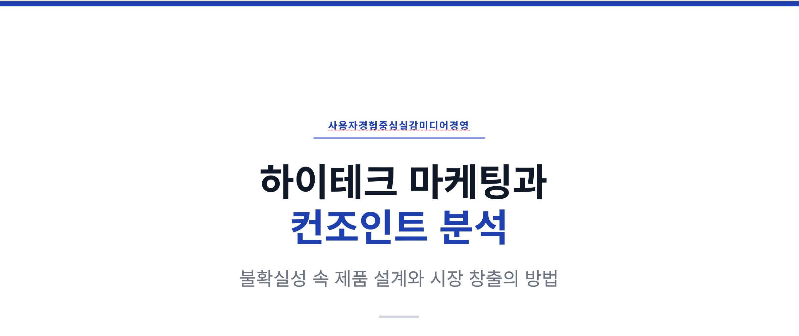
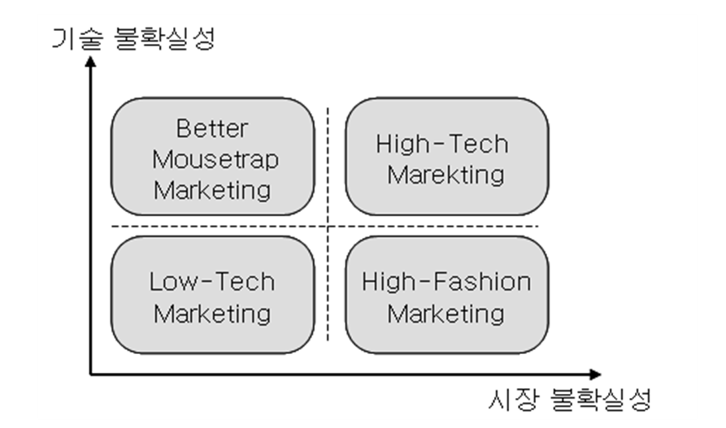
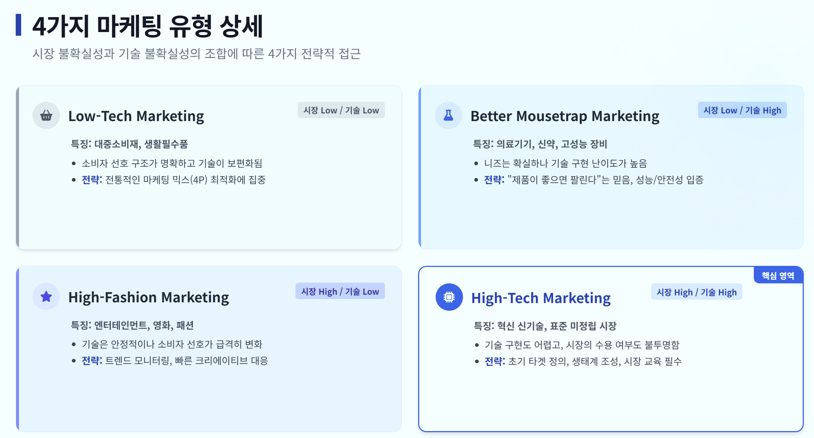
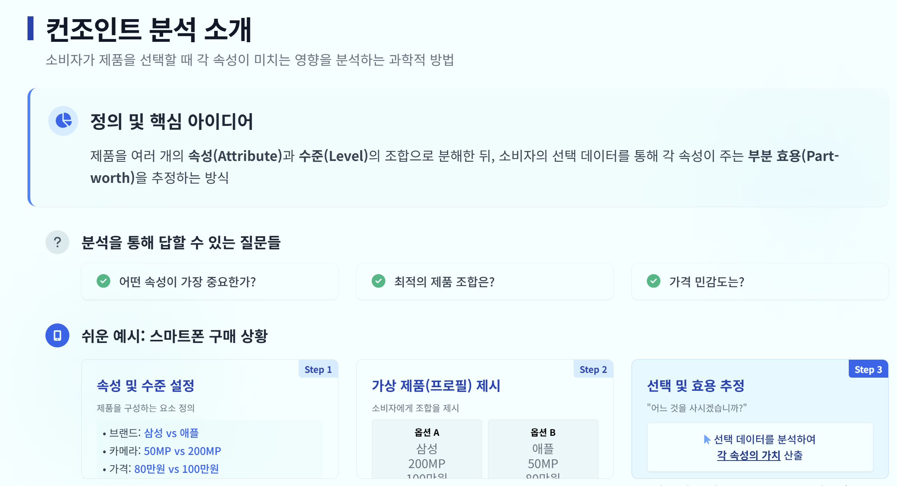
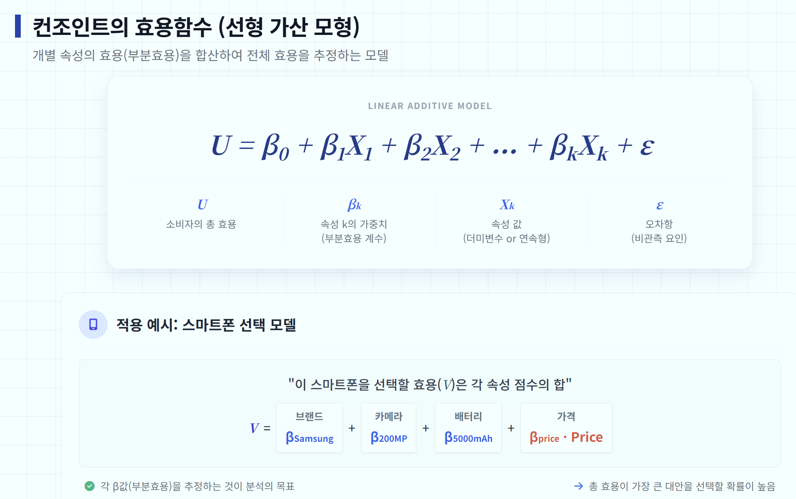
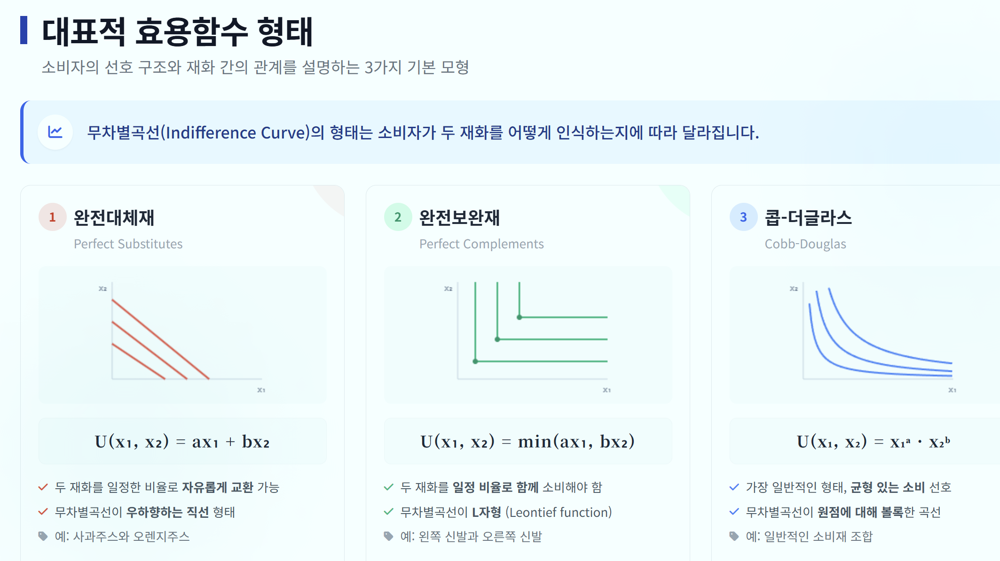

[Weekly content](https://changjunlee.com/teaching/grad_immersive/weekly_2/)

 

## Pre-class video

-   Conjoint Analysis (2) for IMUX



 

 

## 하이테크 시장의 특징

### 1. 하이테크 상품의 정의

-   **하이테크 상품의 정의에 대한 합의 부족**

    -   전문가들 사이에서 명확한 기준이 없음

    -   일반적으로 첨단기술을 활용한 제품으로 정의됨

    -   그러나 대부분의 신상품이 새로운 기술을 포함하므로 범위가 과도하게 넓어질 수 있음

-   **미국 노동통계청(BLS)의 정의**

    -   평균 연구개발비 지출이 미국 전체 기업 평균의 두 배 이상

    -   평균 기술직 고용 인력이 두 배 이상인 기업을 하이테크 기업으로 분류

-   **Regis McKenna의 정의**

    -   제품의 복잡성, 급격한 변화, 혼동스러운 소비자, 다수의 기업가적 경쟁자가 있는 기업

-   **산업별 정의**

    -   IT, BT, NT, CT, ST 등 5가지 첨단산업과 관련된 상품

-   **김상훈(2004)의 정의**

    -   "급격한 기술변화와 상당한 시장 불확실성에 노출된 상품"

-   **하이테크 상품의 특징**

    -   시장이 성숙하여 수요가 안정된 경우 하이테크 상품으로 보기 어려움

    -   기술적 혁신성이 크고 시장의 불확실성이 높다면 하이테크 상품에 해당

-   **하이테크 마케팅의 중요성**

    -   높은 시장 불확실성으로 인해 마케팅이 핵심 요소

-   **주요 이슈**

    -   신상품을 소비자의 요구에 맞게 설계하는 방법

    -   소비자가 제품을 구매하도록 유도하는 방법

    -   시장을 성공적으로 창출하고 확산하는 방법

 

### 2. 하이테크 마케팅

-   **하이테크 산업의 특징**

-   시장 불확실성이 높은 산업군

    -   통신

    -   컴퓨터 하드웨어/소프트웨어

    -   디지털 가전

    -   인터넷 콘텐츠 및 e-비즈니스

    -   바이오 산업 등

-   **하이테크 마케팅의 개념**

    -   하이테크 상품을 대상으로 하는 마케팅

    -   전통적 마케팅과 다른 방식의 접근 필요

 

#### 가. 시장 불확실성 및 기술 불확실성

1.  **시장 불확실성 (Moriarty & Kosnik, 1989)**

-   **소비자 욕구 파악의 어려움**

    -   새로운 시장에서 소비자 선호 구조를 예측하기 어려움

-   **소비자 니즈 변화**

    -   예: 휴대전화의 초기에는 통화 품질이 중요했으나, 이후 휴대성과 기능성이 중요한 요소로 변화

-   **산업 표준의 부재**

    -   제품 출시 시 관련 산업 표준이 미정일 가능성이 큼

    -   예: 특정 메모리 형식(SD vs. T-Flash)의 표준화가 산업 경쟁력을 결정

-   **혁신 확산의 속도 예측 불가능**

    -   신제품이 얼마나 빠르게 시장을 창출할지 예측하기 어려움

-   **잠재 시장 규모의 예측 난항**

    -   신제품의 경우 비슷한 기존 제품이 없어 시장 규모 예측이 어려움

    -   예: DMB 기능이 있는 휴대전화가 이동통신 시장과 방송 시장 중 어디에 속하는지 모호

2.  **기술 불확실성 (Moriarty & Kosnik, 1989)**

-   **제품 성능 불확실성**

    -   제품이 소비자 기대 수준에 부합하는지 확인이 필요

<!-- -->

-   **제품 부작용 가능성**

    -   예: 온라인 결제 시스템의 보안 문제, 의약품의 예상치 못한 부작용

-   **중간재와의 호환성 문제**

    -   예: 온라인 게임의 고품질 그래픽이 네트워크 성능에 의해 제한될 수 있음

-   **제품 개발 및 출시 시기 불확실성**

    -   출시 지연 시 경제적 손실 및 신용 타격 가능성

-   **기술 진부화 위험**

    -   기술 발전이 빠른 산업에서는 기존 기술이 빠르게 대체될 가능성 큼

 

#### 나. 마케팅 유형의 구분

-   **Moriarty & Kosnik (1989)의 분류 기준**

    -   시장 불확실성과 기술 불확실성의 조합에 따라 네 가지 마케팅 유형으로 구분

 

#### 다. 마케팅 유형의 구분

1\. **Low-Tech Marketing**

-   기술 및 시장 불확실성이 모두 낮은 경우

-   **특징**

    -   기존 시장의 규모가 크고 소비자 선호 구조가 비교적 명확

    -   사용되는 기술이 보편화되어 개발 및 생산의 기술적 난이도가 낮음

-   **예시**

    -   생활필수품 및 일반 소비재

-   **마케팅 전략**

    -   전통적인 마케팅 방식으로 충분

 

2\. **High-Fashion Marketing**

-   시장 불확실성이 높지만 기술 불확실성은 낮은 경우

-   **특징**

    -   소비자 선호가 빠르게 변화

    -   기존 시장은 존재하지만 변동성이 큼

-   **예시**

    -   영화, 스포츠, 엔터테인먼트 산업

-   **마케팅 전략**

    -   소비자 선호의 변화 파악이 핵심\

 

3\. **Better Mousetrap Marketing**

-   기술 불확실성이 높지만 시장 불확실성은 낮은 경우

-   “제품이 더 좋으면 자연스럽게 팔린다”는 믿음에 기반한 마케팅 사고방식

-   **특징**

    -   소비자 니즈가 비교적 확실

    -   제품 개발에 높은 기술 수준 요구

-   **예시**

    -   암 치료제, 고성능 의료기기

-   **마케팅 전략**

    -   기능의 우수성 강조

    -   부작용에 대한 소비자의 우려 해소

 

4\. **High-Tech Marketing**

-   기술 및 시장 불확실성이 모두 높은 경우

-   **특징**

    -   기술 개발 및 제품 생산에 높은 수준의 기술력 필요

    -   소비자 선호 및 니즈가 불명확하여 기존 마케팅 전략과 차별화 필요

-   **마케팅 전략**

    -   기존의 전통적인 마케팅 방식과 다른 접근 필요

 

#### 라. 하이테크 마케팅의 특징

1\. **소비자 선호의 이질성 (Heterogeneity)**

-   하이테크 제품은 소비자별로 인식 및 필요성의 차이가 큼

-   필수품이 아닌 경우가 많아 소비자마다 제품 가치를 다르게 평가

-   기술수용모형에서 나타난 혁신자(early adopters)와 대중(consumers) 간의 차이 발생

2\. **동적(Dynamic) 마케팅 전략 필요**

-   시장 초기 목표 고객 선정 후, 성장 단계에서 소비자 변화 대응 필수

-   **전략 요소**

    -   초기 시장 선점

    -   빠른 제품 출시

    -   적절한 타이밍의 시장 전략 결정

3\. **기술 및 마케팅 부서 간 협업 필수**

-   효과적인 하이테크 마케팅을 위해 기술 개발팀과 마케팅팀의 원활한 협력 필요

-   기술 지식이 없는 마케팅팀은 효과적인 전략 수립이 어려움

4\. **시장 동향 및 소비자 니즈 예측의 중요성**

-   **능동적이고 미래지향적인 접근 필수**

    -   현재 소비자 요구만 분석하면 미래 시장 변화 대응이 어려움

-   **잠재적 니즈 발굴의 어려움**

    -   기존 제품 개선보다는 혁신 제품이 많아 시장 조사 자체가 어려운 경우 발생

5\. **하이테크 기업이 직면하는 장애물**

-   조직 내부의 경직성 및 정보 공유 부족

-   고객의 현재 의견에만 의존하면 혁신적 신제품 개발 지연

-   시장 조사만으로 소비자의 미래 선호 예측이 어려움

 

#### 마. 하이테크 마케팅의 핵심

-   하이테크 제품 마케팅은 기존 소비재 마케팅과 달리 **시장 변화 관찰 및 미래 소비자 니즈 예측**이 필수

-   **잠재적 선호 분석이 필요**

 

> 컨조인트 분석(conjoint analysis)은 여러 속성(attribute)과 수준(level)으로 정의되는 대안(제품/서비스/정책안)에 대해 응답자가 보여주는 **총체적 평가(평점·순위·선택)**를 관측한 뒤, 그 평가를 설명하는 **속성 수준별 효용(파트워스, part-worth)**을 추정하여 “무엇이 선택을 좌우하는가”를 정량화하는 **분해적(decompositional) 선호 측정** 방법군을 의미한다. 1990년 Green & Srinivasan의 고전적 정의에 따르면, 컨조인트는 “미리 속성수준으로 규정된 대안들에 대한 전반적 평가로부터 선호 파라미터(파트워스, 중요도 등)를 추정하는 모든 분해적 방법”으로 정리된다. 

현대 실무에서 표준에 가까운 형태는 **선택기반 컨조인트(CBC; choice-based conjoint)**로, 응답자에게 여러 번의 선택과제(choice task)를 제시해 실제 시장의 선택 상황을 모사하고, **랜덤효용이론(Random Utility Theory)**과 이산선택모형(특히 로짓 계열)에 기반해 추정한다. 한국 정책연구 맥락에서도 CBC는 “시장 선택과정을 유사하게 재현”하여 선호를 파악하는 방법으로 소개되며, 속성·수준의 선정과 독립성(공선성 최소화) 고려를 강조한다.

설계·추정의 기술 선택에서 핵심은 (1) **실험설계의 정보량(orthogonal vs. D-efficient, priors 포함)**, (2) **이질성(heterogeneity) 처리 수준(HB/혼합로짓/잠재계층)**, (3) **편향(가상편향·속성무시·스케일 이질성·앵커링) 통제**다. 특히 효율적(choice-efficient) 설계를 위해 Huber & Zwerina가 제시한 직교성·수준균형·최소중복·효용균형 원리 및 D-error 기준이 널리 인용되며, **비선형 선택모형 설계는 ‘사전(anticipated) 파라미터’가 필요**함을 명시한다.

데이터 수집이 온라인 패널로 이동하면서 품질관리(주의도·정직성·스피딩·트랩문항 등)가 중요해졌음.

최신 흐름은 (a) 개별응답자 수준 추정을 표준화한 **계층적 베이즈(HB)**의 확산(상용 툴도 개인 수준 유틸리티 산출에 HB를 채택), (b) **적응형 설계(ACBC/베이즈 적응 설계/폴리헤드럴·액티브러닝)**, (c) **딥러닝·머신러닝과 RUM의 결합**(RUM-net류)로 요약할 수 있다.

 

](images/clipboard-3790418351.png)

](images/clipboard-2499046605.png)

 

## **수학·통계적 기반**

컨조인트 분석의 “수학적 본체”는 (i) 효용모형(utility model), (ii) 파트워스(part-worth) 추정과 식별(identification), (iii) 오차 구조와 스케일(scale), (iv) 설계행렬(coding/design matrix)로 요약된다. CBC/DCE는 특히 이산선택모형(discrete choice model)과 직결되므로 랜덤효용이론을 중심으로 정리

 

### **랜덤효용이론과 로짓 계열**

가장 일반적인 출발점은 다음 분해다.

$$
U_{nit} = V_{nit} + \varepsilon_{nit}, \quad V_{nit} = x_{nit}^\top \beta_n
$$

-   $U_{nit}$: 개인 (n)이 과제 (t)에서 대안 (i)에 부여하는 총효용

-   $V_{nit}$: 관측 가능한 체계적 효용(대표효용)

-   $\varepsilon_{nit}$: 관측 불가능한 오차(확률적 부분)

### 속성(Attribute)과 수준(Level)

콘조인트 분석을 하려면 먼저 제품을 '레고 블록'처럼 쪼개야 합니다.

-   **속성 (Attribute):** 제품을 구성하는 큰 특징이나 카테고리입니다.

    -   *예시:* 브랜드, 가격, 색상, 배터리 용량

-   **수준 (Level):** 각 속성 안에 들어가는 구체적인 옵션입니다.

    -   *예시:* \* \[브랜드\] 속성의 수준: 삼성, 애플, 구글

        -   \[가격\] 속성의 수준: 80만 원, 100만 원, 120만 원

        -   \[색상\] 속성의 수준: 블랙, 화이트

> 💡 **핵심 요약:** 모든 제품은 \[속성\]과 \[수준\]의 조합으로 이루어져 있음. (예: 삼성 + 100만 원 + 블랙)

 

### **파트워스(부분가치)와 식별 문제**

파트워스는 “속성 수준이 총효용에 기여하는 가산적(또는 준가산적) 구성 요소”로 이해할 수 있다. 전통적 풀-프로파일에서는 프로파일 평점(또는 순위)을 종속변수로 두고 다중회귀(OLS 등)로 수준 더미 변수의 계수를 추정해 파트워스를 얻는 방식이 널리 사용되었다.

사람들은 각 '수준(Level)'마다 마음속으로 점수를 부여합니다.

-   애플 = +50점, 삼성 = +40점

-   80만 원 = +100점, 120만 원 = -20점 이러한 개별 조각의 점수를 \*\*부분 가치(Part-worth)\*\*라고 합니다.

**전체 효용 계산 (Total Utility)**

특정 스마트폰의 총 만족도는 각 조각(부분 가치)의 합입니다.

-   **스마트폰 A (애플, 80만 원):** 50점 + 100점 = **150점**

-   **스마트폰 B (삼성, 120만 원):** 40점 + (-20점) = **20점**. 이때 당연히 150점짜리 스마트폰 A를 선택

 

### 로짓 모델

로짓(MNL/conditional logit)은 $\varepsilon$가 i.i.d. type-I extreme value(Gumbel)라는 가정에서 선택확률이 닫힌형(closed-form)으로 나온다.

$$ P_{nit} = \frac{\exp(V_{nit})}{\sum_{j \in C_t} \exp(V_{njt})} $$

효용 점수가 150점, 20점이라고 해서 "150%의 확률로 산다"는 뜻은 아닙니다. 이 추상적인 점수를 '구매 확률(0\~100%)'로 예쁘게 바꿔주는 수학적 변환기가 필요한데, 가장 대표적으로 쓰이는 것이 **다항 로짓 모델(Multinomial Logit Model)**입니다. (점수가 높을수록 선택될 확률이 기하급수적으로 높아지도록 계산해 주는 필터라고 생각하면 됨)

 

### 추정 (Estimation): 마음속 점수는 어떻게 알아낼까?

소비자 머릿속에 들어갈 수는 없으니, 우리는 설문조사를 통해 이 점수($\beta$)를 **역추적(추정)**해야 합니다.

1.  **실험 설계:** 사람들에게 가상의 제품 조합을 보여줍니다.

    -   *"A(애플, 120만원, 블랙) 살래? B(삼성, 80만원, 화이트) 살래?"*

2.  **데이터 수집:** 사람들이 수십 번의 선택을 반복합니다. (이를 선택기반 콘조인트, CBC라고 합니다.)

3.  **컴퓨터의 역추적 (추정 로직):**

    -   "이 사람이 A대신 B를 계속 고르는 걸 보니, 이 사람은 '브랜드'보다 '가격'을 훨씬 중요하게 생각하는구나! 80만 원의 부분 가치를 높게 주자."

4.  **계산 방법 (HB, Hierarchical Bayes):**

    -   요즘 가장 많이 쓰는 추정 방식은 **계층적 베이즈(HB)**. 쉽게 말해, "전체 사람들의 평균적인 성향"을 바탕으로 시작해서, "개인별 선택 데이터"를 학습하며 **한 명 한 명의 맞춤형 부분 가치(점수표)**를 정밀하게 깎아나가는 AI 같은 알고리즘.

 

### 사후 분석 (Post Calculation): 이 데이터로 무엇을 할 수 있을까?

가장 흥미로운 부분. 사람들의 '마음속 점수표(부분 가치)'를 모두 구했다면, 이제 강력한 비즈니스 시뮬레이션을 할 수 있습니다.

**① 속성 중요도 (Relative Importance)**

어떤 속성이 소비자의 선택에 가장 큰 영향을 미치는지 100% 만점으로 환산합니다.

-   계산법: 각 속성별 (최고 수준의 점수 - 최저 수준의 점수)의 격차를 구합니다. 격차가 클수록 소비자가 민감하게 반응한다는 뜻입니다.

-   *결과 예시: 가격 중요도 50%, 브랜드 중요도 30%, 색상 중요도 20%*

**② 시장 점유율 시뮬레이션 (Market Share Simulation)**

경쟁사 제품과 우리 제품을 가상의 시장에 올려놓고 점유율을 예측합니다.

-   "경쟁사가 100만 원짜리 신제품을 냈을 때, 우리가 90만 원으로 가격을 내리면 시장 점유율이 몇 % 나 오를까?"

-   각 개인의 가치 점수표를 바탕으로 어떤 제품을 선택할지 확률을 계산한 뒤 총합을 구합니다. (What-if 분석)

**③ 지불 용의액 (WTP: Willingness to Pay)**

특정 기능을 넣었을 때 소비자가 돈을 얼마나 더 낼 의향이 있는지 계산합니다.

-   계산법: '가치 점수'를 '가격 점수'로 나눕니다.

-   *예시:* 카메라 화소를 업그레이드했을 때 효용이 +10점 오릅니다. 그런데 가격이 1만 원 오를 때마다 효용이 -1점 깎입니다. 그렇다면 10점의 효용은 곧 10만 원의 가치와 같습니다. 즉, "소비자는 카메라 업그레이드에 10만 원까지 더 지불할 용의가 있다"고 해석합니다.

 

> 콘조인트 분석은 **1) 제품을 속성과 수준으로 쪼개고**, **2) 사람들에게 선택 게임을 시켜서**, **3) 각 옵션의 숨겨진 가치(점수)를 수학적으로 추정한 뒤**, **4) 최적의 제품 스펙과 가격을 찾아내는** 매우 과학적인 의사결정 도구.
